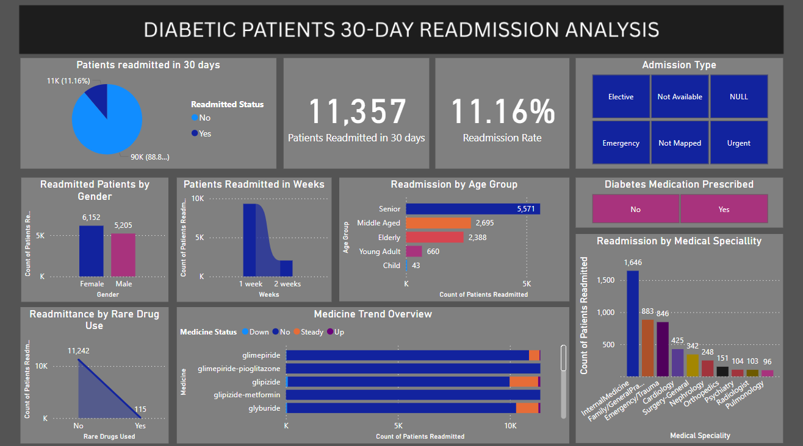

# 📊 Diabetic Patients 30-Day Readmission Analysis

This project analyzes hospital readmission patterns of diabetic patients within 30 days using the **Diabetes 130-US Hospitals dataset** from UCI Machine Learning Repository. The objective is to uncover insights about treatment, demographics, and risk factors associated with early readmission.

---

## 📂 Data Source

- Dataset: [UCI Diabetes 130-US Hospitals (1999–2008)](http://archive.ics.uci.edu/dataset/296/diabetes+130-us+hospitals+for+years+1999-2008)

---

## 🛠️ Data Cleaning & Transformation

- Created `age_group` column from the existing `age` field
- Removed `weight` column due to high null values and low relevance
- Handled missing data in key columns such as `race`, `gender`, `medical_specialty`, etc.
- Created a binary `readmitted_status` column:
  ```dax
  readmitted_status = IF(diabetic_data[readmitted] = 1, "Yes", "No")
  ```
- Derived `weeks_in_hospital` from `time_in_hospital`
- Created `admission_type_desc` column from `admission_type_id` using the following mapping:
  | ID | Description   |
  | -- | ------------- |
  | 1  | Emergency     |
  | 2  | Urgent        |
  | 3  | Elective      |
  | 4  | Newborn       |
  | 5  | Not Available |
  | 6  | NULL          |
  | 7  | Trauma Center |
  | 8  | Not Mapped    |

---

## 💊 Rare Drug Classification

Certain medications were classified as rare based on clinical obsolescence, withdrawal, or extremely limited usage. A new binary feature `rare_drugs_used` was created:

- **Nateglinide** – Rarely used meglitinide with short action and lower efficacy  
- **Chlorpropamide** – Obsolete first-gen sulfonylurea with high hypoglycemia risk  
- **Acetohexamide** – Discontinued sulfonylurea with poor safety and efficacy  
- **Acarbose** – Postprandial control; causes GI side effects  
- **Miglitol** – Similar to acarbose; poorly tolerated  
- **Troglitazone** – Withdrawn due to liver toxicity  
- **Tolazamide** – Outdated first-gen drug  
- **Examide** – Not a real-world drug; synthetic entry  
- **Citoglipton** – Fictitious or experimental drug  

---

## 🔄 Feature Engineering

- Unpivoted medicine columns to track status trends (Up, Down, Steady, No)
- Created binary `rare_drugs_used` column
- Encoded readmission as `readmitted_status` (Yes/No)

---

## 📊 DAX Measures Used

```dax
patients_count = DISTINCTCOUNT(diabetic_data[encounter_id])

readmitted_count = CALCULATE(
    DISTINCTCOUNT(diabetic_data[encounter_id]),
    diabetic_data[readmitted_status] = "Yes"
)

readmitted_percent = DIVIDE([readmitted_count], [patients_count], 0)

readmitted_percent_by_age_group =
DIVIDE([readmitted_count], CALCULATE([readmitted_count], REMOVEFILTERS(diabetic_data[age_group])))

readmitted_percent_by_gender =
DIVIDE([readmitted_count], CALCULATE([readmitted_count], REMOVEFILTERS(diabetic_data[gender])))

readmitted_percent_by_medical_specialty =
DIVIDE([readmitted_count], CALCULATE([readmitted_count], REMOVEFILTERS(diabetic_data[medical_specialty])))

readmitted_percent_by_raredruguse =
DIVIDE([readmitted_count], CALCULATE([readmitted_count], REMOVEFILTERS(diabetic_data[rare_drugs_used])))

readmitted_percent_by_week =
DIVIDE([readmitted_count], CALCULATE([readmitted_count], REMOVEFILTERS(diabetic_data[weeks_in_hospital])))
```

---

## ❓ Key Questions Answered

- How many diabetic patients were readmitted within 30 days?  
- What is the 30-day readmission rate for diabetic patients?  
- Which age group is most frequently readmitted?  
- Which gender has more readmissions?  
- How soon after discharge are patients getting readmitted?

---

## 🔍 Key Insights from the Dashboard

- **11.16%** of patients were readmitted within 30 days  
- **Female patients** had a slightly higher readmission count than males  
- **Senior age group** had the highest readmission count (5,571)  
- **Rare drug usage** was associated with only 115 readmissions out of 11,357  
- The **first week of hospital stay** had the majority of readmissions  
- **Internal Medicine** and **Family/General Practice** saw the highest readmission volumes  
- Most medications remained in the "No" or "Steady" status range, with very few "Up" or "Down" trends

---

## 🌐 Tools Used

- Power BI  
- Power Query  
- DAX (Data Analysis Expressions)  
- Excel

---

## 📷 Dashboard Preview



---

## 📁 Files Included

- `readmitted_dashboard.pbix` – Power BI template with all visuals and KPIs


---

## 📁 Repository Structure

```
project_root/
│
├── Images/
│   └── dashboard.png
│
├── raw_data/
│   ├── diabetic_dataset.csv
│   └── IDS_mapping.csv
│
├── cleaned_data/
│   └── diabetic_data.csv
│
├── readmitted_dashboard.pbix
└── README.md
```
